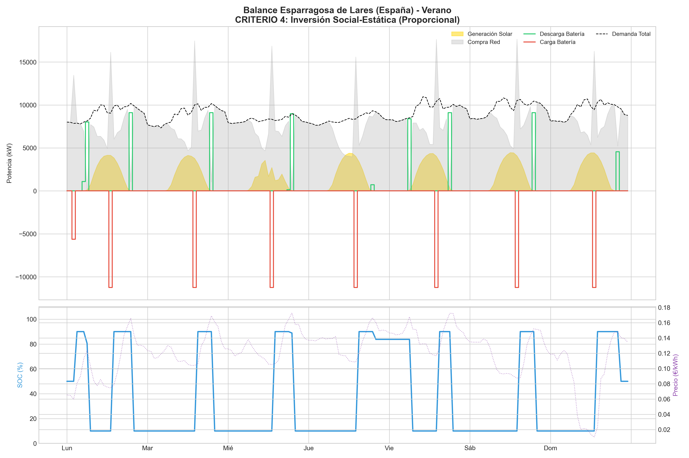
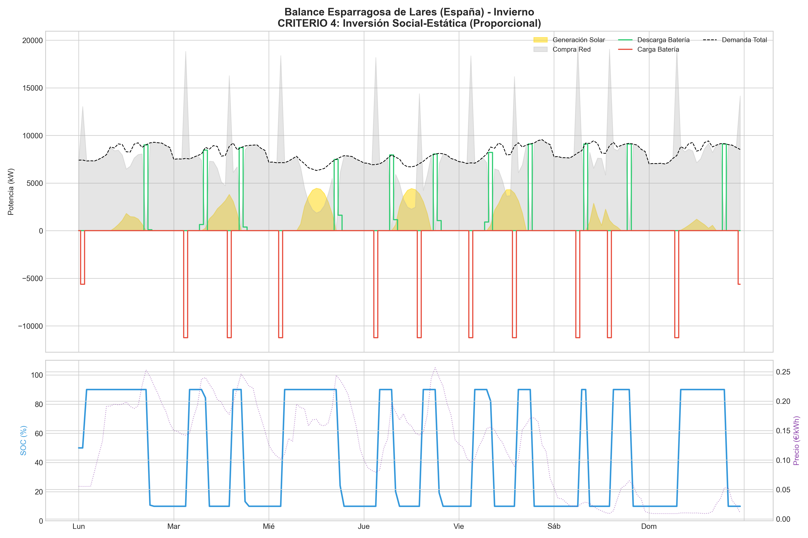
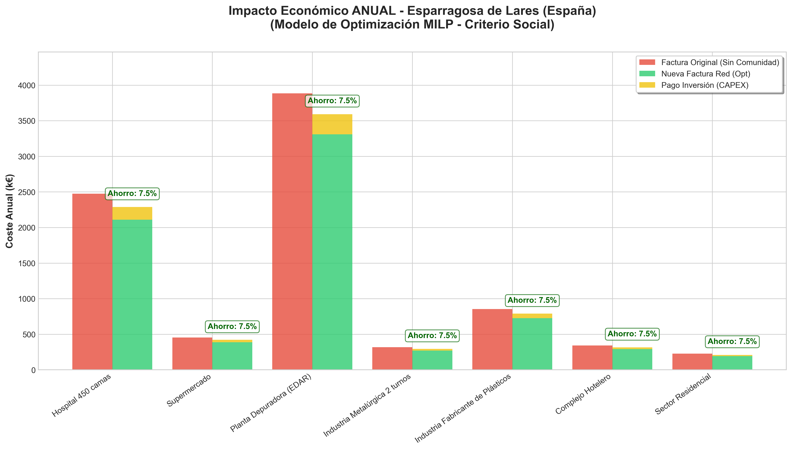
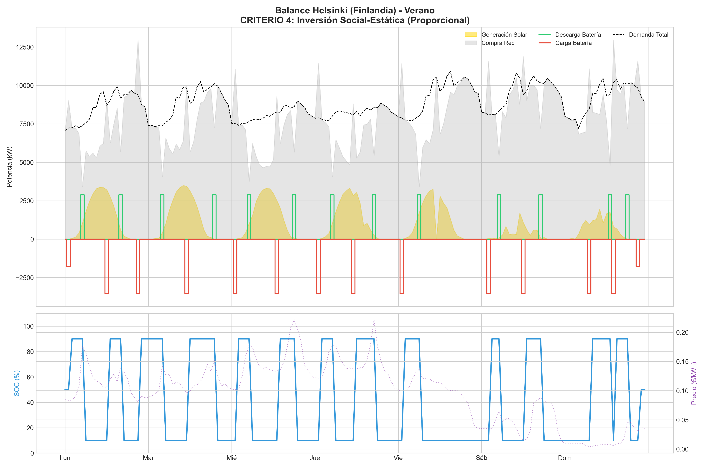
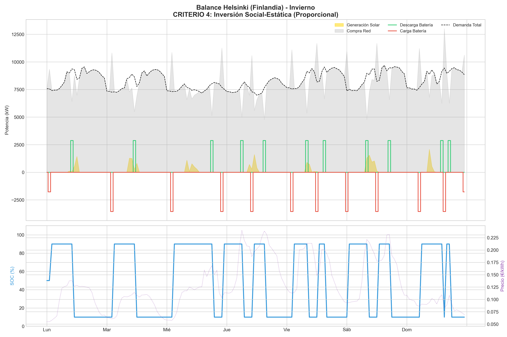
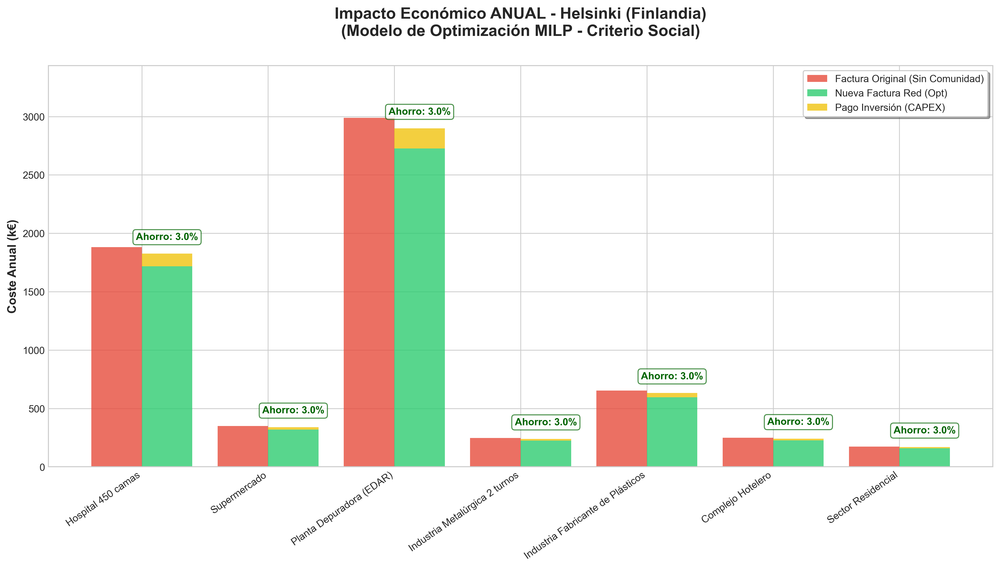

# Optimización MILP de Comunidad Energética Local

### TL;DR
* **Qué es:** Modelo MILP para dimensionamiento (FV+BESS) y operación de una comunidad energética de 7 consumidores.
* **Objetivo:** Minimizar coste anualizado (CAPEX+OPEX) incorporando estructura tarifaria 6.2TD, peajes por periodos, impuestos y criterios de equidad social.
* **Stack:** Python (Pyomo) + HiGHS.
* **Casos:** Comparativa climática Esparragosa (ES) vs Helsinki (FI).
* **Resultados:** Configuración FV/BESS óptima, balance energético semanal y análisis de trade-off económico vs resiliencia (mínimo de BESS para Hospital).
* **Ejecución:** Notebook interactivo `Modelo_Optimizacion_MILP.ipynb`.

Este repositorio contiene un modelo de optimización matemática basado en Programación Lineal Entera Mixta (MILP) para la gestión operativa de una comunidad de 7 consumidores industriales y residenciales.

## Resumen del Proyecto
Desarrollo de un modelo económico con señal de precios y peajes por periodos (6.2TD) e impuestos, aplicado al dimensionamiento óptimo de instalaciones FV (techo/suelo) y almacenamiento BESS, con análisis de reparto equitativo entre consumidores.

## Dimensionamiento Óptimo de la Instalación
El modelo minimiza el coste total anualizado ($CAPEX + OPEX$) utilizando variables binarias para discriminar superficies de instalación.

| Componente | Esparragosa de Lares (ES) | Helsinki (FI) |
| :--- | :--- | :--- |
| Fotovoltaica en Tejado | 9.000 Paneles (4.500 kWp) | 9.000 Paneles (4.500 kWp) |
| Fotovoltaica en Suelo | 3.333 Paneles (1.666,5 kWp) | 0 Paneles |
| Módulos de Batería (BESS) | 2.529 Módulos (12.645 kWh) | 800 Módulos (4.000 kWh)* |
| Ahorro Neto Común | 7,5% | 3,0% |

> `*Nota: En Helsinki se impone una capacidad mínima de BESS por resiliencia para el Hospital (C2). Sin esta restricción técnica, el modelo económico tendería a prescindir de baterías.`

### El Coste de la Resiliencia en Helsinki
Sin restricciones de seguridad, el ahorro en Finlandia sería del **3,2%** sin baterías. Al imponer el mínimo de **800 módulos** por seguridad crítica:
* **Resultado:** El ahorro neto desciende al **3,0%**.
* **Conclusión:** Esa diferencia del **0,2%** actúa como una "prima de seguro" para garantizar el suministro de consumidores críticos.

## Optimización vs. Factor Social: Análisis de Criterios
Se evaluaron 5 criterios de reparto, concluyendo que la optimización matemática pura no siempre es viable socialmente:
* **Criterios 1-3:** Generan desigualdades; los pequeños consumidores pueden terminar pagando más que antes de unirse a la comunidad.
* **Criterio 5 (Flexible):** El solver tiende a cargar más inversión a los pequeños para maximizar la eficiencia global.
* **Criterio 4 (Social-Estático):** **Modelo seleccionado**. Al fijar inversión proporcional al consumo, garantiza un ahorro idéntico para todos los vecinos, asegurando la cohesión del proyecto.

## Análisis de Operación y Resultados

### Escenario: Esparragosa de Lares (España)
#### Operación Semanal (Verano e Invierno)

#### Impacto Económico Anualizado

### Escenario: Helsinki (Finlandia)
#### Operación Semanal (Verano e Invierno)

#### Impacto Económico Anualizado

## Ejecución
1. Abrir `Modelo_Optimizacion_MILP.ipynb`.
2. Ejecutar todas las celdas (**Run All**).
3. Requisitos: Python, Pyomo, HiGHS, pandas, matplotlib.

---
Contacto: jreyesmavs@gmail.com | [LinkedIn](https://www.linkedin.com/in/jorgereyesgon)
