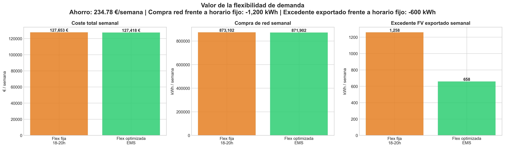
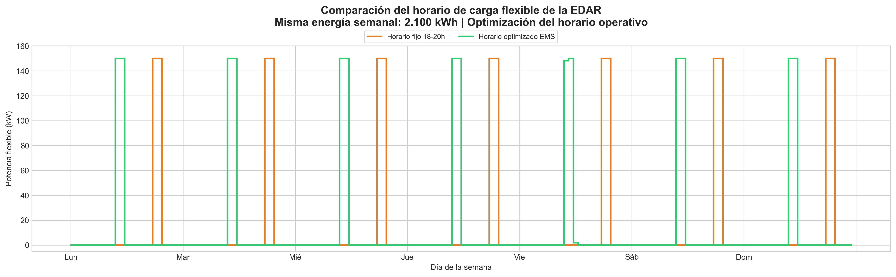
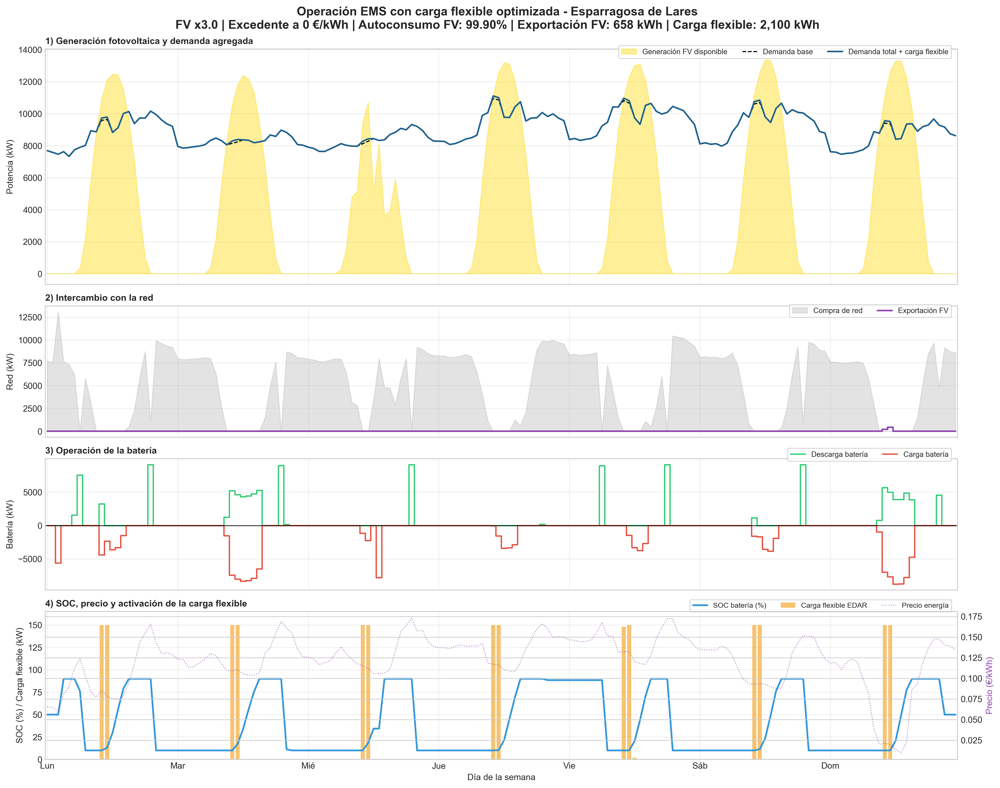
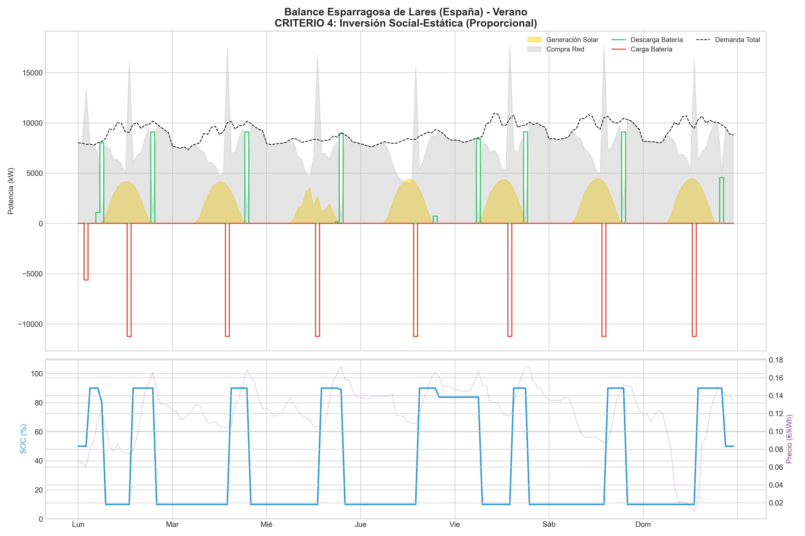
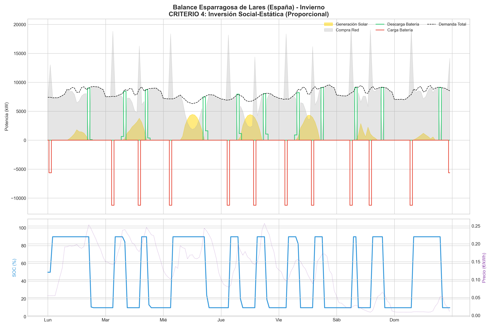
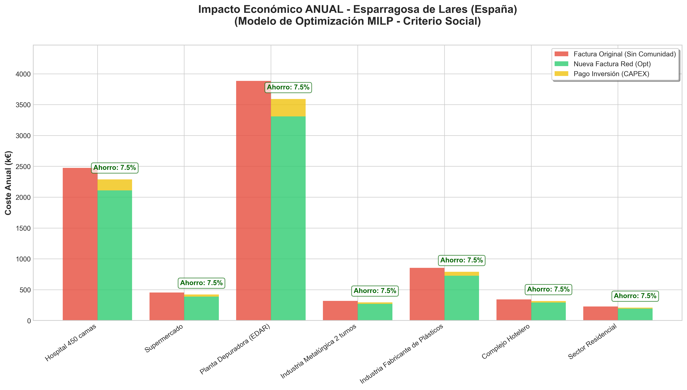
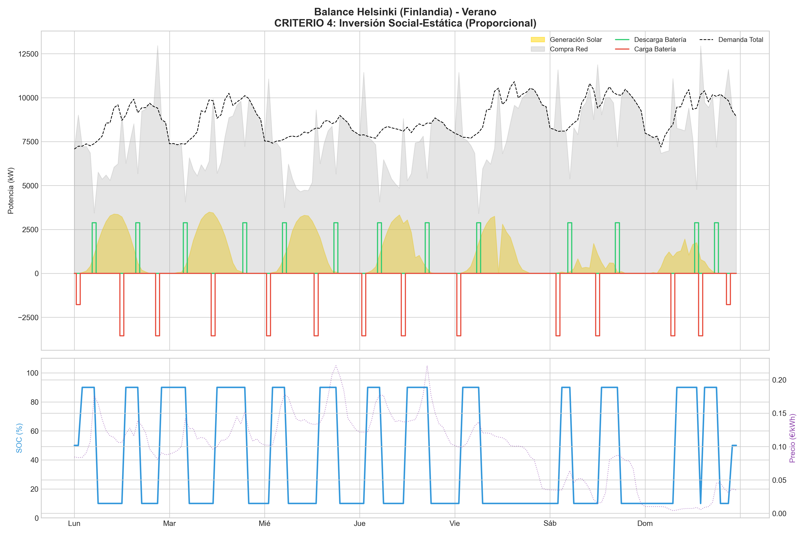
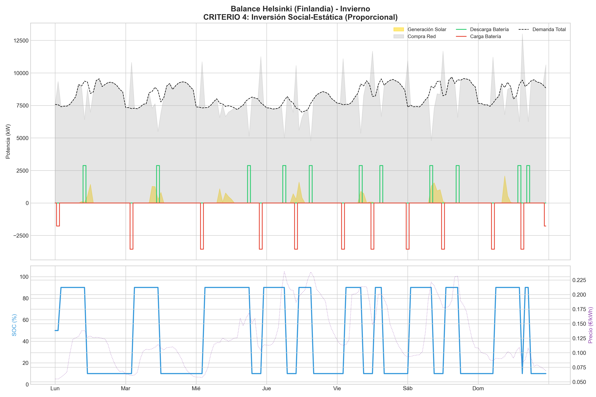
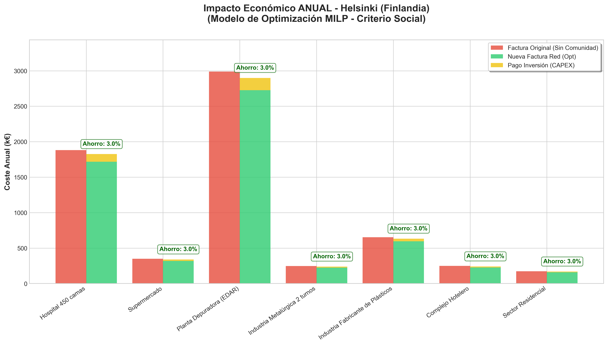

# Optimización MILP y EMS de Comunidad Energética Local

### TL;DR
* **Qué es:** Modelo MILP para dimensionamiento, operación y reparto energético de una comunidad energética de 7 consumidores.
* **Objetivo base:** Minimizar coste anualizado (CAPEX+OPEX) incorporando estructura tarifaria, peajes por periodos, impuestos, FV, BESS y criterios de equidad social.
* **Extensión EMS:** Análisis de operación semanal con alta penetración FV, excedente valorado a 0 €/kWh y carga flexible asociada a la EDAR.
* **Stack:** Python (Pyomo) + HiGHS + pandas + matplotlib.
* **Casos base:** Comparativa climática Esparragosa de Lares (ES) vs Helsinki (FI).
* **Resultado EMS:** La optimización horaria de la carga flexible reduce el coste en **234,78 €/semana**, la compra de red en **1.200 kWh/semana** y el excedente exportado en **600 kWh/semana** frente a un horario fijo.
* **Ejecución:** Notebooks `Modelo_Optimizacion_MILP.ipynb` y `Modelo_EMS_Excedentes_FV_Esparragosa.ipynb`.

Este repositorio contiene un modelo de optimización matemática basado en Programación Lineal Entera Mixta (MILP) aplicado a una comunidad energética local. El trabajo se divide en dos partes: primero, el dimensionamiento de instalaciones fotovoltaicas y almacenamiento BESS con criterios de reparto social; segundo, una extensión tipo EMS para analizar la operación semanal con alta penetración fotovoltaica y carga flexible.

## Resumen del Proyecto

El modelo base desarrolla una comunidad energética formada por 7 consumidores industriales, comerciales y residenciales. Se consideran datos horarios de demanda, generación fotovoltaica, precios eléctricos, peajes e impuestos. El objetivo inicial es dimensionar la instalación FV+BESS y analizar cómo se reparte el beneficio económico entre los miembros.

La extensión EMS parte de la instalación ya dimensionada y estudia una pregunta operativa más concreta:

> Si aumenta mucho la potencia FV disponible y el excedente se valora a 0 €/kWh, ¿puede una carga flexible reducir la compra de red y la energía exportada sin cambiar la energía total consumida?

Para responderlo, se compara una programación fija de la carga flexible con una programación optimizada por el EMS.

## Comunidad energética analizada

| ID | Consumidor |
| :--- | :--- |
| C2 | Hospital 450 camas |
| C8 | Supermercado |
| C9 | Planta Depuradora (EDAR) |
| C11 | Industria Metalúrgica 2 turnos |
| C15 | Industria Fabricante de Plásticos |
| C19 | Complejo Hotelero |
| C21 | Sector Residencial |

## 1. Dimensionamiento Óptimo de la Instalación

El modelo minimiza el coste total anualizado ($CAPEX + OPEX$) utilizando variables enteras para discretizar paneles FV y módulos de batería. También diferencia entre instalación fotovoltaica en tejado y en suelo.

| Componente | Esparragosa de Lares (ES) | Helsinki (FI) |
| :--- | :--- | :--- |
| Fotovoltaica en Tejado | 9.000 paneles (4.500 kWp) | 9.000 paneles (4.500 kWp) |
| Fotovoltaica en Suelo | 3.333 paneles (1.666,5 kWp) | 0 paneles |
| Módulos de Batería (BESS) | 2.529 módulos (12.645 kWh) | 800 módulos (4.000 kWh)* |
| Ahorro Neto Común | 7,5% aprox. | 3,0% aprox. |

> `*Nota: En Helsinki se impone una capacidad mínima de BESS por resiliencia para el Hospital (C2). Sin esta restricción técnica, el modelo económico tendería a prescindir de baterías.`

### El Coste de la Resiliencia en Helsinki

Sin restricciones de seguridad, el ahorro en Finlandia sería del **3,2%** sin baterías. Al imponer el mínimo de **800 módulos** por seguridad crítica:

* **Resultado:** El ahorro neto desciende al **3,0%**.
* **Conclusión:** Esa diferencia del **0,2%** actúa como una “prima de seguro” para garantizar el suministro de consumidores críticos.

## 2. Optimización vs. Factor Social: Análisis de Criterios

Se evaluaron 5 criterios de reparto, concluyendo que la optimización matemática pura no siempre es viable socialmente:

* **Criterios 1-3:** Generan desigualdades; los pequeños consumidores pueden terminar pagando más que antes de unirse a la comunidad.
* **Criterio 5 (Flexible):** El solver tiende a mover cuotas de inversión para maximizar la eficiencia global, pero puede generar resultados menos intuitivos desde el punto de vista cooperativo.
* **Criterio 4 (Social-Estático):** **Modelo seleccionado**. Al fijar la inversión proporcionalmente a la factura base y forzar un ahorro porcentual común, garantiza una distribución más estable y defendible para todos los miembros.

## 3. Extensión EMS: Excedentes FV y Carga Flexible

La extensión EMS se centra en Esparragosa de Lares y usa una semana representativa de verano. El objetivo no es redimensionar económicamente toda la instalación, sino estudiar la operación del sistema ante un escenario de alta penetración fotovoltaica.

### Escenario EMS utilizado

| Parámetro | Valor |
| :--- | ---: |
| Ubicación | Esparragosa de Lares |
| Semana representativa | Verano |
| FV total base | 6.166,5 kWp |
| Batería BESS | 12.645 kWh |
| Factor de sensibilidad FV | x3,0 |
| FV equivalente | 18.499,5 kWp |
| Valor económico del excedente | 0 €/kWh |
| Exportación a red | Permitida |
| Carga flexible | EDAR |
| Energía flexible semanal | 2.100 kWh |
| Potencia flexible máxima | 150 kW |
| Ventana flexible optimizable | 10:00–20:00 |

> Nota: el escenario “excedente a 0 €/kWh” no significa que la exportación esté prohibida. La exportación sigue permitida, pero no genera ingresos económicos. Por eso el modelo puede exportar una pequeña cantidad cuando no resulta posible absorber toda la generación local.

### Comparación de escenarios EMS

| Escenario | Coste total semanal | Ahorro neto | Compra red | Excedente exportado | Autoconsumo FV |
| :--- | ---: | ---: | ---: | ---: | ---: |
| Base FV x1,0 | 169.679 € | 13.590 € | 1.297.625 kWh | 0 kWh | 100,00% |
| FV x3,0 sin flexibilidad | 127.319 € | 55.950 € | 871.002 kWh | 1.258 kWh | 99,81% |
| FV x3,0 con flex fija 18–20h | 127.653 € | 55.616 € | 873.102 kWh | 1.258 kWh | 99,81% |
| FV x3,0 con flex optimizada | 127.418 € | 55.851 € | 871.902 kWh | 658 kWh | 99,90% |

La comparación relevante es entre la carga flexible fija y la carga flexible optimizada, ya que ambas consumen exactamente **2.100 kWh semanales**. La diferencia procede únicamente del horario de activación.

| Métrica | Mejora frente a horario fijo |
| :--- | ---: |
| Ahorro adicional | 234,78 €/semana |
| Reducción de compra de red | 1.200 kWh/semana |
| Reducción de excedente exportado | 600 kWh/semana |

## 4. Visualización de Resultados EMS

### Valor de la flexibilidad de demanda

La siguiente figura resume el impacto de optimizar el horario de la carga flexible frente a mantener un horario fijo de 18:00 a 20:00.



### Horario de activación de la carga flexible

En ambos casos la EDAR consume la misma energía semanal: **2.100 kWh**. El caso fijo opera de 18:00 a 20:00, mientras que el EMS desplaza la carga hacia horas más favorables para el autoconsumo FV.



### Operación semanal del EMS

La siguiente figura muestra la operación semanal completa del EMS en el escenario FV x3,0 con excedente valorado a 0 €/kWh y exportación permitida. Se representan generación FV, demanda, compra de red, exportación, batería, SOC, precio y activación de la carga flexible.



## 5. Resultados del Modelo Base

### Escenario: Esparragosa de Lares (España)

#### Operación Semanal (Verano e Invierno)





#### Impacto Económico Anualizado



### Escenario: Helsinki (Finlandia)

#### Operación Semanal (Verano e Invierno)





#### Impacto Económico Anualizado



## Conclusiones

El modelo base muestra cómo dimensionar una comunidad energética con FV y BESS considerando costes anualizados, señal de precios, peajes e impuestos. Además, el criterio social-estático permite mantener un ahorro porcentual común entre consumidores, evitando que la optimización puramente económica perjudique a determinados perfiles.

La extensión EMS muestra que, en escenarios de alta penetración FV, la flexibilidad de demanda puede aportar valor operativo. Manteniendo constante la energía semanal consumida por la EDAR, el EMS desplaza la carga hacia horas más favorables, reduciendo la compra de red, disminuyendo el excedente exportado y mejorando el coste total frente a una programación fija.

## Tecnologías utilizadas

* Python
* Pyomo
* HiGHS
* pandas
* numpy
* matplotlib
* MILP

## Ejecución

1. Clonar el repositorio.
2. Abrir uno de los notebooks:
   * `Modelo_Optimizacion_MILP.ipynb`
   * `Modelo_EMS_Excedentes_FV_Esparragosa.ipynb`
3. Ejecutar las celdas en orden.
4. Requisitos principales: Python, Pyomo, HiGHS, pandas, numpy y matplotlib.

## Estructura actual del repositorio

```text
.
├── data/
├── Modelo_Optimizacion_MILP.ipynb
├── Modelo_EMS_Excedentes_FV_Esparragosa.ipynb
├── Analisis_Esparragosa_de_Lares_Verano.png
├── Analisis_Esparragosa_de_Lares_Invierno.png
├── Analisis_Helsinki_Verano.png
├── Analisis_Helsinki_Invierno.png
├── Impacto_Economico_Anual_Esparragosa_de_Lares.png
├── Impacto_Economico_Anual_Helsinki.png
├── Balance_EMS_Flexible_Optimizado_Limpio.png
├── Comparacion_Flexibilidad_Fija_vs_Optimizada.png
├── Horario_Carga_Flexible.png
├── LICENCE
└── README.md
